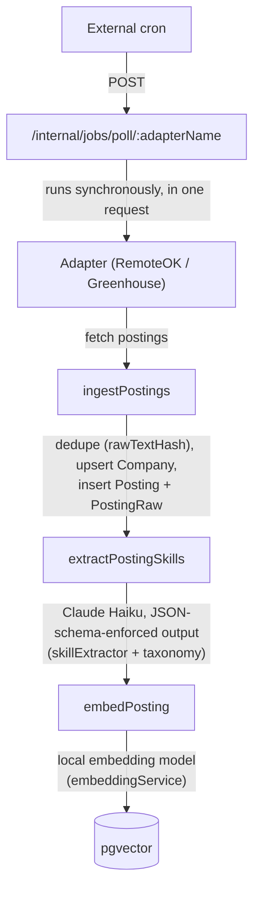
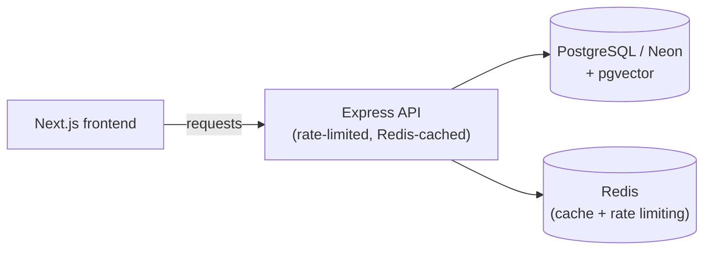

# RoleRadar

A developer job intelligence platform that aggregates postings from multiple sources, extracts structured skill data with an LLM, and turns that into **skill-gap analysis**, **semantic job matching**, and a **retrieval-augmented Q&A interface** over your own job market data.

Most job boards let you bookmark postings. RoleRadar reads them: every posting is parsed into structured skills, seniority, and role category, embedded into a vector store, and made queryable — so you can ask "what backend roles want Redis but not Kubernetes?" and get an answer grounded in postings that actually exist in the database, not a general-knowledge guess.

## What it does

- **Aggregates** job postings from RemoteOK and Greenhouse company boards via their public APIs (no scraping, no ToS risk)
- **Extracts** structured skill data from raw job text using **Claude Haiku** with schema-enforced JSON output — required skills, nice-to-have skills, seniority, years of experience, role category
- **Embeds** every posting locally (no external embedding API) so it can be searched by meaning, not just keyword
- **Matches** postings to a user's skill profile using vector similarity, hybrid-filtered by the profile's own skills and inferred role category
- **Answers questions in plain English** about the aggregated job market, with retrieval-grounded, cited responses and an explicit refusal when the data can't support an answer
- **Analyzes skill gaps** — ranks which in-demand skills a profile is missing, weighted by how frequently the market actually asks for them
- **Tracks applications** through a save → applied → screening → interview → offer/rejected pipeline with a full, append-only stage history

## Architecture

### Why there's no background worker

The pipeline was originally designed around **BullMQ + Redis-backed queues** with an always-on worker process polling sources every few hours. That's the right shape for a production system, but it requires a second always-on process — which on Render means a **second paid instance (~$7/mo)** with nothing to show for it between polls.

For a single-tenant portfolio deployment, that cost buys nothing a scheduled HTTP call can't do more cheaply. The pipeline logic itself didn't change — fetch → dedupe/ingest → extract → embed still runs as one sequence — it's just invoked synchronously inside a single request instead of a queued job:

\`\`\`
POST /internal/jobs/poll/:adapterName   (shared-secret header, internalOnly middleware)
\`\`\`

An external scheduler (e.g. GitHub Actions on a cron schedule, or Render's own cron jobs) hits this endpoint periodically. The request runs the full batch — every new posting is fetched, deduped, extracted, and embedded — and returns a summary before responding, so the server's request timeout is raised well past the default to give a full batch room to finish. If a future version needs to run continuously, the same `pollSource()` function this endpoint calls is queue-ready — it doesn't know or care whether it was invoked by an HTTP request or a job payload.

## Tech stack

**Backend** — Node.js, Express, TypeScript, Prisma, PostgreSQL (Neon) with the `pgvector` extension, Redis (caching + rate limiting), Anthropic SDK (Claude Haiku), `@xenova/transformers` (local embeddings, no external API), Zod, Pino.

**Frontend** — Next.js (App Router), React, TypeScript, TanStack Query, shadcn/ui + Radix, Tailwind CSS, `@dnd-kit` (pipeline drag-and-drop), Recharts.

## Core features

### Skill extraction
Raw job description text is sanitized (HTML entity decoding, tag stripping) and sent to **Claude Haiku** with a **JSON-schema-enforced response** — the API constrains the output shape directly rather than relying on post-hoc validation of a loosely-typed JSON blob. Extracted skill names are normalized against a canonical taxonomy (`ReactJS` → `React`, `Postgres` → `PostgreSQL`) so the same skill from different postings always resolves to one row.

### Semantic matching
Every posting and the user's profile are embedded with a local `all-MiniLM-L6-v2` model — **no per-call API cost**, no external embedding provider. Postings are ranked against a profile by cosine distance in pgvector, **hybrid-filtered** so results are always restricted to postings that share at least one of the profile's actual skills — similarity ranking alone can otherwise let an unrelated posting with a similar-sounding title outrank a real match.

### Retrieval-augmented Q&A
`/api/ask` takes a natural-language question, retrieves the most relevant postings (vector search, optionally pre-filtered by a skill or role category it detects in the question), and passes only that retrieved context — structured fields, not raw job text — to Claude for a grounded answer. **The system prompt restricts the model to the provided context** and requires it to say so when the data can't answer the question, rather than falling back on general knowledge.

### Skill gap analysis
Compares a profile's skills against aggregate market demand for a chosen role category, ranking missing skills by how large a share of postings actually require them. A profile's target role is free text (for display) and is **never used to drive this comparison directly** — the role category is either explicitly selected or inferred from which categories the profile's own skills are most concentrated in, with an honest "not enough data" state when a role has too few postings to measure.

### Application pipeline
A Kanban board (Saved → Applied → Screening → Interview → Offer/Rejected) backed by an **append-only stage-history table**, so time-in-stage and funnel metrics are derivable later without having thrown away the data that would answer them.

## API surface

| Endpoint | Purpose |
|---|---|
| `GET /health` | Liveness/readiness check |
| `POST /internal/jobs/poll/:adapterName` | Triggers a full fetch → ingest → extract → embed cycle for one source (internal, shared-secret protected) |
| `GET /internal/extraction/stats` | Extraction pipeline health and top-skill counts (internal) |
| `GET /api/analytics/trending` | Skill frequency across recent postings, filterable by role category |
| `GET /api/analytics/skill-gap` | Ranked skill gaps for a profile against a role category's market demand |
| `GET /api/postings` | Paginated posting list with extracted skills |
| `GET /api/postings/recommended` | Vector-similarity job matches for the current profile |
| `POST /api/ask` | Retrieval-augmented natural-language Q&A over the posting database |
| `GET/POST/PATCH/DELETE /api/applications` | Application pipeline CRUD and stage transitions |
| `GET/POST/DELETE /api/profile/skills` | Profile skill management |

All public routes sit behind a **Redis-backed, per-IP rate limiter** (stricter on `/api/ask`, since each call spends real LLM tokens) and return structured `RateLimit-*`/`Retry-After` headers on `429`.

## Data sources

Postings are pulled from public, ToS-compliant, non-scraped sources:
- **RemoteOK** — public JSON API
- **Greenhouse** — per-company board API (`boards-api.greenhouse.io`), configured per board token in `src/config/sourceBoards.ts`

**LinkedIn and Glassdoor are deliberately excluded** — both actively block automated access, and scraping them is a fragile foundation for a project meant to run reliably in a demo. A Lever adapter and a Puppeteer-based career-page adapter are the next planned additions (see Roadmap).

## Getting started

### Prerequisites
- Node.js 20+
- A PostgreSQL database with the `pgvector` extension available (e.g. Neon)
- A Redis instance
- An Anthropic API key

### Backend

\`\`\`bash
npm install
cp .env.example .env   # fill in DATABASE_URL, REDIS_URL, ANTHROPIC_API_KEY, INTERNAL_API_SECRET
npm run prisma:generate
npm run prisma:migrate
npm run dev
\`\`\`

Trigger an initial data pull manually (this is what the external scheduler would otherwise call):

\`\`\`bash
curl -X POST http://localhost:3000/internal/jobs/poll/REMOTEOK \
  -H "Authorization: Bearer $INTERNAL_API_SECRET"
\`\`\`

### Frontend

\`\`\`bash
cd frontend
npm install
npm run dev
\`\`\`

### Scheduling ingestion in production

Since there's no in-process scheduler, point an external cron (GitHub Actions on a schedule, Render Cron Jobs, or similar) at `POST /internal/jobs/poll/:adapterName` for each configured source, on whatever interval fits your API budget. The request includes the full fetch-through-embed cycle and responds once it's done.
